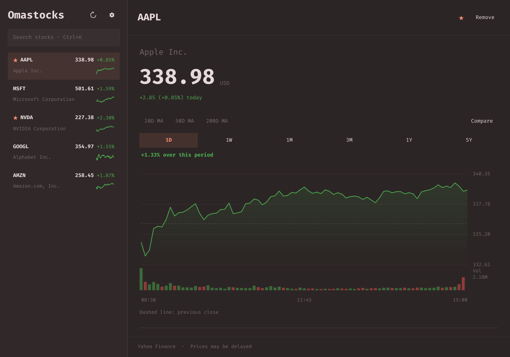

# Omastocks

A window-first stock watchlist for Omarchy, with an optional favorites strip.

Sector heatmaps, named watchlists, performance overviews, earnings calendars, price and fundamental
comparisons, insider activity, charts, financials and news. No API keys.

Built with Quickshell and Omarchy's live theme tokens. The main view is a regular
Wayland window: tile it, move it to a workspace, or put it in the scratchpad.
The window and its heading are named **Stocks**; the plugin and launcher are **Omastocks**.



## Install

Requires **Omarchy Quattro's Quickshell-based shell**, Python **3.10+**, and the
system timezone database (`tzdata`). Uses Omarchy's `qs.Commons` / `qs.Ui` and
Quickshell's Qt Quick Controls, layouts, IO and Wayland modules. Bash, Git, and
the standard coreutils utilities are used for installation. These are provided
by a current Omarchy installation; no Python packages or API keys are required.

```sh
omarchy plugin add https://github.com/dmitry-solomadin/omastocks --enable
omarchy-shell io.github.dmitry-solomadin.omastocks open
```

Click the favorites strip to open **Omastocks**. To also add it to your application
launcher, run the optional, user-local launcher installer:

```sh
~/.config/omarchy/plugins/io.github.dmitry-solomadin.omastocks/install-launcher
```

It installs the launcher entry and the Omastocks icon (`icon.svg`, the logo's
candlesticks) under your user data directory; `uninstall` removes both.

No root access or changes to `/usr/share/omarchy` are needed. The marketplace's
installer loads the manifest directly; it does not run this repository's scripts.

Closing the window leaves the strip running. Use the gear button to open
**Settings**, then toggle **Enable topbar widget**. You can also hide it with
`omarchy bar set io.github.dmitry-solomadin.omastocks showStrip false --json`. The window remains
available from the launcher. Set it to `true` to show the strip again.

The bar defaults to **ticker + daily percentage change**. In Settings, choose
any combination of **Price**, **Percentage change**, and **Price change ($)**,
and adjust **Maximum width**. Absolute changes use each stock's quote currency.
These preferences also appear in Omarchy's bar widget settings (`showPrice`,
`showPercent`, `showChange`, and `maxWidth`).

When the favorites fit, the strip is stationary and only takes the space it
needs. Otherwise, all favorites scroll continuously right-to-left; hover to pause.
The threshold is measured using the bar's actual font: the sum of each entry's
rendered width, plus an 18-unit gap between entries and 8.5-unit padding on each
side, compared with the available width (capped at `maxWidth`, default 360).
Spacing and the width cap follow Omarchy's UI scale. Text is remeasured when
quotes, favorites, selected fields, or fonts change. Vertical bars use the Omastocks
icon. The favorites widget has no hover tooltip.

### Update and remove

```sh
omarchy plugin update io.github.dmitry-solomadin.omastocks
# Remove the plugin and optional launcher, after Omarchy asks for confirmation:
~/.config/omarchy/plugins/io.github.dmitry-solomadin.omastocks/uninstall
```

Removal preserves your watchlist and cached data. If you did not install the
launcher, `omarchy plugin remove io.github.dmitry-solomadin.omastocks` also works.
The scripts accept `--yes` for explicitly confirmed, non-interactive removal.

## Use

- Click a watchlist entry, or use Up/Down, to immediately view its chart and market statistics.
- Drag a watchlist row up or down to reorder it. The insertion line marks the
  drop position; hold near the top or bottom to scroll longer lists. The order is
  saved and also determines the order of starred stocks in the bar. Clear search
  before rearranging; choose **Custom** sorting to enable dragging. Escape or
  dropping outside the list cancels a drag.
- Click the **Sort Watchlist** button beside the pen to choose **Custom**, **Price
  Change**, **Percentage Change**, **Market Cap**, **Symbol**, or **Name**. Numeric
  sorts are highest-first (changes use the regular-session daily change); names
  and symbols are A–Z, with missing values last. Sidebar and Overview use the same
  order. Each list remembers its choice; Custom restores its saved manual order.
- Type in the sidebar to filter your watchlist and automatically search Yahoo Finance.
  Adding a search result with **+** clears the search, selects the added stock,
  and switches to the Stock tab after the add succeeds.
- **Settings → Watchlist** selects one sidebar metric: **Display percentage
  change**, **Display price change**, or **Display market cap**. The choice is
  saved globally across lists; market cap uses the shared bulk quote request.
  It changes the metric beside the current price, not the Overview return columns
  or the watchlist's sort order.
  A bundled catalog adds 21 major indices, 28 index ETFs and 7 index mutual funds
  with common names and aliases: try **nasdaq**, **sp500**, **dow**, or
  **vanguard sp500**. Index tickers work with or without `^`; the S&P 500 uses
  **^SPX**. Exact tickers rank first, then relevant catalog matches and Yahoo
  results, deduplicated by symbol. Catalog matches survive Yahoo search failures.
  The editable table is `bin/search_catalog.json`; `SPLG` resolves to `SPYM`, and
  Yahoo's alternate `^GSPC` listing is consolidated into `^SPX` in search results.
- Click **+** beside a search result to add it directly to your watchlist, or
  click the result to preview it first.
- Star a stock to show it in the bar. Favorites are shared across watchlists and
  appear once in the bar, in first-list / first-occurrence order. Removing a stock
  from one list keeps its star if it remains starred in another list. Removing
  its last membership removes it from the bar; re-adding it starts unstarred.
- Choose 1D, 1W, 1M, 3M, 1Y or 5Y; hover the chart to inspect a price.
- Market Details uses equal-width columns. Its 52-week range gauge shows the low
  and high at either end, with a dot for the current price; hover for exact values.
- Click and drag across the chart to compare two points. The highlighted interval
  shows the price and percentage change from its earlier point to its later one,
  in either drag direction. Endpoints snap to available quotes. Click again or
  press Escape to clear it; loading new chart data also clears the selection.
- The period's percentage change appears just below the range buttons. A dragged
  selection replaces it with the selected interval's price and percentage change.
- During an open market session, 1D spans through the scheduled market close,
  leaving the remaining time empty. Hours come from the exchange session supplied
  by Yahoo, including early closes; no prices are projected into that space.
- A timestamped **Pre-market / After-hours** quote appears beneath the selected
  stock's daily change when Yahoo supplies an extended-session observation.
  Its change is measured against the preceding regular-session close; the main
  quote, watchlist and favorites ticker use regular-session prices.
- On **1D**, toggle **Extended** to include pre-market and after-hours prices.
  Shaded regions identify extended sessions and hover labels identify the session.
  Session boundaries come from Yahoo's exchange timestamps, including early
  closes and daylight saving changes. Unsupported symbols disable the toggle.
  The choice is remembered for the shell session and returns after leaving
  Compare or switching back from a longer range.
- Extended prices are sampled from Yahoo's five-minute chart feed and may be
  delayed. Their date/time is always shown in your local timezone, including for
  a completed session. The selected stock's extended feed refreshes once a minute
  while the window is open, independently of regular quotes.
- Ctrl+K focuses search; Escape clears it; Ctrl+R refreshes prices.
- Down from the search field selects the first result; Up/Down immediately select adjacent stocks.
- Ctrl+W closes the window.
- Mouse-wheel scrolling moves 96 scaled UI pixels per notch in both panes;
  high-resolution touchpad pixel deltas retain their native movement.

## Watchlist workspace

The navigation above the detail pane switches between **Stock**, **Market**, and
**Watchlist**. Watchlist combines **Overview** and **Calendar** as sections on one
scrolling page. Clicking a symbol returns to the Stock view.
Ctrl+R refreshes the current workspace view. Tables scroll
horizontally in narrow windows; vertical wheel scrolling still moves the page.

- **Multiple watchlists:** hover over the list name above search (or focus it
  with Tab) to reveal the dropdown and switch lists. Click the **pen** to open
  the Watchlists popup, which lists every watchlist with a trash button. Hover a
  row to highlight it, click to edit the name inline, then click the checkmark (or press
  Enter) to save. Escape or clicking outside the row cancels an inline edit. Add lists with the field at the
  bottom. Up to 12 lists, 60 stocks each.
  Lists keep separate membership and order; quotes and favorites are shared.
  Search/add/remove/reorder apply to the active list. The original watchlist is
  migrated in memory and persisted on the next edit, preserving order, favorites,
  names and extra metadata. The last list cannot be removed. No research notes.
- **Market:** **Across markets** opens the page with index futures (S&P 500,
  Nasdaq 100, Dow), commodities (gold, silver, crude oil, natural gas, copper),
  crypto (Bitcoin, Ethereum, Solana) and rates & currencies (US 10Y and 30Y
  yields, the dollar index, EUR/USD, USD/JPY). Yields show their daily change in
  basis points. A row opens the instrument in the Stock view, where company-only
  panels are skipped for futures, crypto and currencies.
  **Sentiment** shows CNN's Fear & Greed index (0–100, with the previous close,
  week, month and year) and the VIX term structure (9-day, 30-day, 3- and 6-month);
  an inverted curve is flagged as stress. The **Economic calendar**
  lists the next high-importance US releases (TradingView: CPI, payrolls, Fed, GDP,
  PCE, ISM…) in local time with forecast, previous and, once released, the actual,
  colored above/below forecast; it sits above Market news. The **Market map**
  section opens with **Leading/Lagging**, today's best and worst sectors from the
  SPDR sector ETFs (clicking one opens its heatmap). Select any of Yahoo's 11 sectors for a 50-stock, market-cap-weighted
  treemap. Tile area represents each company's share of the displayed market cap;
  color shows performance. Small tiles reveal details on hover; missing market
  caps appear as separate ticker buttons rather than invented tile sizes.
  The dropdown also includes **S&P 500**, **Nasdaq 100** and **Dow Jones**.
  Their one-time TradingView membership snapshots contain 503, 101 and 30
  listings respectively (multiple share classes can appear). Each index refresh
  uses **one TradingView bulk request** for the saved exchange-qualified listings,
  including daily/YTD returns and market caps; no per-stock chart/history requests.
  Large maps use one canvas with themed hover details rather than thousands of
  QML tile controls. Sizes represent company market cap, not official index weights.
  Index maps default to the **Top 50** by market cap, with **Top 100 / All** controls
  for broader coverage. Market opens on **S&P 500 · Top 50**.
  The index performance row (S&P 500, Nasdaq Composite,
  Dow Jones, VIX) uses shared bulk quotes and refreshes every five minutes.
  Market-wide and macro headlines below the map come from a targeted Google News
  RSS search of established financial/news publishers. Headlines must concern
  market moves, rates, inflation or economic data; stock-picking stories are
  excluded. Only dated stories from the last 72 hours are shown, newest first,
  with duplicate headlines removed. Refreshes every ten minutes; links open via
  Google News in your browser. The feed needs no account or key.
  Switch between daily change and the provider's YTD return, or click a tile to open the
  stock. Membership comes from the bundled one-time Top Companies snapshot;
  one bulk sector response supplies values for the selected sector. Missing
  members remain **—**. Only the selected group refreshes, every 15 minutes.
  The controls share a row with the retrieval timestamp; provider/error details
  are in themed tooltips. The timestamp is retrieval time, not individual quote
  times. YTD follows the provider's definition rather than Overview's calculated
  calendar-boundary return. Membership is never added to personal watchlists.
- **Overview:** 1D, 1W, 1M, YTD and 1Y price-return columns in the sidebar's selected
  sort order, an optional
  equal-sized heatmap.
  Returns exclude dividends. 1D uses the prior regular-session close; longer
  periods compare the latest regular price with the close on or before the
  calendar-date boundary (YTD uses the prior year-end). Hover for baseline and
  quote timestamps. IPOs or insufficient history show **—**. One bulk request
  fetches current prices for the watchlist and all four benchmarks every five
  minutes. This same bulk response supplies numeric sidebar sorting, including
  market cap, without a second Overview request. Historical baselines use a separate daily cache, invalidated when the
  exchange date changes. The first visit still needs one history download per
  uncached stock; subsequent price refreshes reuse successful baselines.
- **Fundamentals:** appears beneath the chart when you enter **Compare** in the
  Stock view, using exactly the same tickers as the chart (including stocks not
  in your watchlist). Add/remove tickers through the comparison controls. Compare
  growth, margins, revenue, free cash flow, net debt, leverage and valuation ratios.
  Annual/quarterly select the latest reported 12M/3M statement records, not TTM.
  Each cell retains its fiscal date and reporting currency; companies may have
  different fiscal years. Valuations are current provider snapshots with their
  own definitions (P/E is TTM). Missing latest cells stay missing rather than
  falling back to older periods. Data loads on demand with a one-hour cache.
- **Calendar:** This week, Next week or All upcoming, sorted by estimated report
  date. Shows a next-quarter EPS estimate when supplied and the last reported EPS
  surprise. Negative EPS estimates use their absolute value as the surprise
  denominator; zero estimates leave the percentage unavailable. Timing is shown
  only if explicitly supplied. Uses Yahoo's symbol-filtered bulk earnings
  calendar, with bounded 100-row pagination, rather than two requests per stock.
  Looks back 180 days for the latest reported result and ahead 365 days for the
  next report; dates may be estimates. EPS currency is not supplied by this
  endpoint, so no currency is inferred. Unsupported instruments and missing dates
  are listed separately. Six-hour cache; failed/incomplete page sets retain the
  previous complete snapshot.
- **Insider activity:** expand beneath Analysts in the Stock view. A **Past 3
  months** summary shows net buying/selling by shares, shares bought versus sold,
  their proportions, and transaction counts. These are Nasdaq's complete
  three-month aggregate fields, not a sum of the 30 recent records shown below.
  The window is trailing three months, not since the last earnings report or a
  fiscal quarter boundary. Buy counts are labeled open-market buys; sales include
  automatic sales. This measures share volume, not dollars or the number of
  individual insiders. Missing totals stay unknown; zero activity is distinguished
  from balanced buying/selling. Hover for exact share counts and refresh for the
  retrieval time; provider as-of text is shown when supplied.
  Below the summary are up to 30 reported transactions with trade date, person, role, transaction
  type, shares, price, direct/indirect ownership and shares held. Types such as
  automatic sales, option exercises and non-open-market dispositions retain the
  provider's wording; they are not recategorized as discretionary buys/sells.
  Insider links open the Nasdaq insider page, not an inferred matching Form 4.
  Data loads only when expanded and caches for one hour.

Per-symbol research batches run at most four requests concurrently, separately from
the watchlist lock. Changing a list/view discards obsolete replies. Manual refresh
bypasses live-data TTL and ordinary failure cooldowns; successful daily Overview
baselines are retained. Yahoo HTTP 429 pauses requests across helpers, including
manual refresh, honoring `Retry-After` and otherwise increasing the delay from two
minutes up to an hour. Yahoo requests share 250 ms start-time pacing; this is an
application traffic policy, not a published Yahoo allowance. Bulk session cookies
and crumbs are private local files under the plugin's state directory, shared
across requests; no account or API key is needed. Errors remain visible;
cached results survive failed refreshes. Partial fundamental-provider failures
show the available provider's metrics and an explicit notice.

## Pixel artwork preview

- Each time the window opens, the visible page header plays a short intro
  painted over the header: a pixel price line draws across
  a dotted previous-close baseline (green above, red below, dithered fill) ending
  on the S&P 500's latest direction, pins a flag with its daily move when known,
  then dissolves outward from the last price to reveal the header. It takes no
  input, so the app is usable immediately.
- The sidebar logo (`StocksLogo.qml`) is a vector candlestick mark
  (`CandleMark.qml`) beside "Stocks"; the candles rise when the window opens.
- The Stock and Market headers share a pixel "Wall Street sky" drawn at 45%
  opacity behind them (70% on light themes). The sun crosses the header on the
  New York clock over the 04:00–20:00 ET day: dawn during pre-market, daylight
  with drifting clouds while open, dusk after hours, and a moon with twinkling
  stars when closed. The NYSE facade's hall lights and flag follow the session;
  the flag is raised with confetti when a known non-regular session turns
  regular. A status chip under each title shows the provider-reported session
  with a countdown to the next open/close. The clock only positions and counts
  down; holidays are not modelled, so the countdown is hidden whenever the
  provider state disagrees with the schedule. Benchmarks, the session and
  cross-asset quotes share one request, independent of the active watchlist. It
  reloads in the background when the window opens, on the refresh button,
  every five minutes, and 5 s after each scheduled session change, retrying every
   15 s (up to four checks total) until the provider reports the new session; the chip keeps its last session
   while reloading and shows "Checking market…" only before the first result.
   Session timers stop when the window closes and account for daylight-saving
   changes over weekends.
- The Market header carries a pixel bull/bear following the **S&P 500's latest
  daily change** (neutral for zero or unavailable) and the benchmarks, each showing
  its price and daily change; clicking one opens it in the Stock view.
- Empty sidebar states show a minimal terminal prompt: an empty list types and
  erases example tickers, searching echoes the query with ticking dots, and a
  miss leaves the query at a blinking cursor.

Original sprites live in `PixelSprites.js`, rendered at integer pixel sizes by
`PixelArt.qml`; session math is in `MarketClock.js` (`node tests/test_pixel_art.cjs`).
`MarketMood.qml`, `SessionHeader.qml`
(with `StocksIntro.qml`, `MarketSession.qml`, `MarketStatus.qml`, `MarketSky.qml`) and
`WatchlistEmpty.qml` are separate components for easy refinement/removal.

## Brief me

This experimental feature is developed on `feature/brief-me`.

**Brief me** on the Stock page hands a bounded snapshot to **your default Omarchy
agent**, using `omarchy agent prompt`. It opens that agent's normal window with its
existing model and authentication; no extra model installation, provider account,
or API key is configured in Omastocks. Set an installed/authenticated agent using
Omarchy's default-agent settings first.
When that default is `opencode` and `opencode2` is installed, Brief me resolves
the launch to V2 within its isolated request directory. Global agent settings and
PATH are unchanged.

The agent writes a structured brief back to Stocks with four sections: **Recent
developments, Business performance, Expectations, Things to watch**. Citation
buttons open the supplied source pages; the brief shows its snapshot time and
agent. Only this stock's locally cached quote, available research and headline
metadata are supplied—not the watchlist, credentials or full articles. Unopened
research sections may be missing; load the sections you want covered before
generating. No additional market-data fetching is triggered by Brief me.

Generation is explicit. Reopening a saved brief reads the cache; the refresh button
requests a new agent session with a fresh snapshot. An identical snapshot reuses
the previous brief unless explicitly regenerated. Stocks checks the result's
request identity, section structure and source IDs before displaying it. It cannot
guarantee the model's interpretation; source links are provided for verification.
If no result arrives within five minutes, check the agent window and retry.

Briefs and isolated request snapshots are stored in the plugin state directory's
`briefs/` folder. The agent session remains available for follow-up questions.

## Chart analysis and company news

The Watchlist earnings calendar also shows **Revenue estimate** for the upcoming
report and **Last revenue surprise** (actual minus consensus, divided by the
absolute consensus). One supplemental TradingView bulk request serves the entire
watchlist. Figures are attached only when the provider's report date matches the
calendar date; missing data, ambiguous listings, differing dates, and zero surprise
denominators remain **—**. Hover over revenue surprise for actual and estimated
amounts and the source. The table scrolls horizontally to fit the added columns.

Non-company instruments (indexes, futures, crypto and currencies) are identified
by Yahoo's instrument-type metadata, with symbol-format fallbacks for older caches.
Earnings/calls, financial statements, analyst targets, company valuations and
insider activity are hidden for them, and their requests are disabled.
They remain available for chart comparison
but are excluded from company fundamental comparisons. Tracking ETFs such as SPY
are distinct instruments and are not classified as indexes.

- **Settings → Chart → Volume bars** shows per-interval trading volume below the price chart. Hover a
  regular-session price point to see its volume. Pre-market and after-hours hover
  readouts omit volume. Missing volume is left blank rather than invented.
- **20D MA / 50D MA / 200D MA** toggle daily simple moving averages, using up to
  ten years of daily price history for warm-up. Colors match the buttons. They are
  available on **1M and longer** ranges, and sample daily averages at their chart
  intervals. Intraday ranges omit these overlays to preserve the price scale;
  your selected averages return when switching back to a longer range. The price
  axis includes enabled averages so they remain visible; a distant long-term
  average can make short-term price movement appear flatter. Newly listed stocks
  may not have enough history for every average.
- Click **Compare** next to the MA buttons to enter a focused chart-and-fundamentals
  view. The individual company header, quote summary, earnings, market details,
  financial statements, analysts, activity, news and social sections are hidden,
  and their research requests pause. The ticker field replaces the MA controls.
  Enter a symbol such as **MSFT**, **SPY**, or **^GSPC** and press Enter or **Add**.
  Compare up to **five stocks total**: the selected stock plus four additional
  symbols. Each has an independent request and a distinct, solid-colored line.
  The chart legend identifies each stock and its period return; its **×** removes
  that stock. Failed/loading requests are indicated in the legend, with details
  in its tooltip. All plotted lines use percentage change from their first shared
  trading interval, matching timestamps or session dates rather than sample numbers.
  Hover shows each plotted stock's actual price and currency for a single shared
  date. Missing intervals are skipped rather than filled with invented prices.
  Prices retain each stock's quoted currency; no currency conversion is applied.
  Hover dates omit the time for 1M and longer ranges.
  Moving averages, volume and event markers are hidden in Compare mode. Use the
  **×** beside Add, or Escape, to exit and restore the regular chart and remembered
  MA selections. Click-and-drag interval selection remains available in regular mode.
- **Settings → Chart → Event markers** marks recent reported earnings (**E**), ex-dividend dates (**D**), and
  splits (**S**). Hover for details. A **+** combines events in the same chart bar.
  Only events within the visible date range are plotted.
- The **Earnings** section shows the next estimated report date and the latest
  reported EPS versus its estimate, plus reported revenue and its consensus
  estimate for the same release. Revenue uses TradingView's public scanner feed,
  includes its currency, and is attached only when the release date matches the
  earnings report. Unavailable revenue or estimates display as **—**.
  Nasdaq/Zacks provides upcoming estimates and
  a limited recent earnings history for supported US stocks. Dates are labeled
  estimated; unsupported symbols and provider failures show an unavailable state.
  Expand **Earnings calls** for up to 12 recent transcript links from Yahoo Finance,
  in the provider's newest-first order. Links load on demand and are cached for a
  day; clicking a call opens its individual transcript in your browser.
- **Latest News** shows relevant company headlines, publishers, dates and optional
  thumbnails from Yahoo. Clicking a story opens the publisher in your browser.
   Yahoo's symbol-scoped search supplies candidates; an explicit ticker/company
   mention in the headline is required. Provider ticker tags alone are insufficient
   because they can include unrelated stocks. Missing or different listing tags
   are accepted when the headline itself matches the company.
   If Yahoo yields fewer than 12 relevant stories, one company-scoped Google News
   RSS request adds coverage from the past seven days. The same headline filter
   applies to both sources; duplicate titles/URLs are removed. Up to 20 articles
   are displayed, newest first—this is not a daily article quota.
  No API key is required. This is a headline feed, not a full-article reader.

## Social chatter

Select the **Social** tab beside **Latest News** for two free, keyless sources:

- **Stocktwits** shows up to 20 recent posts for the selected symbol, with the
  author, timestamp, likes when supplied, and a link to the original post. Long
  posts are abbreviated in the list. Bullish/Bearish labels are the author's own
  selection; missing sentiment is left blank. Symbol coverage varies by market.
- **Reddit buzz** uses ApeWisdom's `all-stocks` rankings: mentions, upvotes, rank,
  and mention change versus its 24-hours-ago snapshot. These are activity counts,
  not a computed bullish/bearish rating. Missing values display as **—**; a symbol
  absent from the rankings is reported as unlisted, not as having zero mentions.
  ApeWisdom tracks selected stock-focused subreddits rather than all of Reddit.

Both sources load only while the Social tab is selected and the window is open.
Stocktwits is cached for five minutes; ApeWisdom for 30 minutes, shared across
symbols. ApeWisdom pagination includes up to 20 pages (2,000 ranked entries).
Manual refresh bypasses the cache and failure cooldown. Provider failures retain
saved data with an error message. No account, API key, or paid fallback is used.
The public endpoints can change or become unavailable.

Source references: [Stocktwits](https://stocktwits.com/),
[ApeWisdom API](https://apewisdom.io/api),
[ApeWisdom methodology](https://apewisdom.io/methodology).

## Financial statements and valuations

Expand **Financials** below Market Details. Choose **Income**, **Balance Sheet**,
or **Cash Flow**, then **Quarterly** or **Annual**. Click any metric row to chart
its history. Scroll the table horizontally in narrow windows.
Vertical wheel scrolling over the table continues scrolling the company pane.

- Income: revenue, cost of revenue, gross profit, R&D, selling/administration,
  operating income, EBITDA, net income and diluted EPS.
- Balance sheet: cash, cash/short-term investments, assets, liabilities, debt,
  net debt and shareholders' equity.
- Cash flow: operating, investing and financing cash flow, capex, free cash
  flow, share repurchases and dividends paid.
- Derived metrics: gross/operating/net margins, revenue growth versus the same
  period a year earlier, current ratio, debt/equity and free cash flow margin.
  Ratios require matching dates/currencies and positive denominators.
- Market Details adds TradingView market cap, trailing P/E, price/sales,
  price/book, EV/EBITDA, sector and industry for supported US listings.
- **Filings ↗** opens the symbol's SEC EDGAR company page in your browser.
- **Yahoo ↗** opens the selected Income, Balance Sheet, or Cash Flow statement on
  Yahoo Finance for more detail.

Yahoo's fundamentals-timeseries endpoint supplies the statements. It currently
usually returns **four annual and five quarterly periods**, with coverage varying
by metric and company. Entirely unavailable metrics are omitted; missing cells
are **—**, never zero. Indices/ETFs may have no statements. Some international
companies lack quarterly cash flow. Each value retains the **statement reporting
currency**, which can differ from the stock's trading currency. Money is shown
in units, millions (M), billions (B), or trillions (T); EPS stays per share.

Period-end dates are displayed as Yahoo supplies them; these may be normalized
to calendar month-end rather than the company's exact fiscal closing date.
Only standalone three-month or full-year records are accepted, not YTD figures.
Statement diluted EPS is separate from the earnings-surprise feed's EPS and
can differ in definition. Valuations retain TradingView's field definitions and
are not currency-converted. Financials are fetched only when expanded and cached
for one day; valuations cache for one hour. Refresh controls expose
source and error details; saved results remain available after a failed refresh.

## Analyst recommendations

Expand **Analysts** below Financials. Use **TipRanks ↗** in its header to open the
stock's full analyst forecasts and price targets. The section shows:

- A green/neutral/red **Buy / Hold / Sell** distribution with counts and the total
  number of analysts. Hover a segment for its percentage.
- **Average price target** and its implied upside/downside versus the current
  regular-session quote.
- A **target-price gauge**: the highlighted range runs from low to high, the
  accent tick marks the average target, and the dot marks the current price.
  The scale expands when the current price falls outside the target range.
- Expand **History** for monthly average targets and recommendation counts,
  newest first. Coverage currently typically includes 13 monthly snapshots.

Counts, targets, and history come together from Nasdaq's public `targetprice`
endpoint (TipRanks). They are not mixed with Nasdaq's separate ratings feed,
which can use a different analyst group. Historical snapshots retain their own
counts, so the latest month's counts may differ from the current summary.
Targets are USD amounts for supported US listings. Implied returns and the
current-price marker appear only when the quote currency matches. Missing counts
stay missing; a distribution requires all three counts and a positive total.

Analyst data loads on demand and caches for one day. The refresh button's tooltip
shows the source, retrieval time and any error; failed refreshes retain saved
results. Retrieval time is not the publication date of an individual rating.

News, earnings, financials, analysts, valuations, extended hours, moving averages and comparisons use independent helper processes
and per-request caches under the state's `research/` directory. They do not take
the watchlist lock or wait behind the price/chart queue. News caches for ten minutes,
earnings for six hours, daily-average history for one hour, and comparison charts
for one minute intraday or one hour historically. Failed refreshes retain saved
data and back off before automatic retries. Manual refresh bypasses both the
cache and ordinary retry cooldown, but respects a shared Yahoo HTTP 429 pause.
Each section has its own loading/error state;
Ctrl+R also refreshes these sections. Volume and event visibility are saved in
plugin settings. Moving-average and comparison choices last for the shell session.

## Data

Yahoo Finance's unofficial chart, search, fundamentals, sector, bulk quote and
calendar endpoints supply prices, history, corporate actions, headlines, financial
statements and the watchlist earnings calendar; Nasdaq/Zacks supplies the Stock
view's earnings dates and EPS; TradingView supplies valuations and earnings
revenue comparisons. Prices may be delayed. Quote currency is shown in the
window; chart hover times use your computer's local timezone. Requests are
cached, and failed refreshes keep the last successful data marked as stale.
The bar polls every five minutes. Opening the window refreshes data older than
one minute. Search waits for a 300 ms pause in typing before requesting results;
replies for older queries are ignored.

The initial watchlist is AAPL, MSFT, NVDA, GOOGL and AMZN; AAPL and NVDA are
starred. State lives in `${XDG_STATE_HOME:-~/.local/state}/omarchy/io.github.dmitry-solomadin.omastocks`.
Watchlist edits are atomic and protected by a file lock. The Python helpers handle
market requests and watchlist storage. Bar preferences are saved through Omarchy's
plugin settings API, preserving the other settings in `shell.json`.

### Network and storage

The helpers contact `query1.finance.yahoo.com`, `finance.yahoo.com`, `fc.yahoo.com`,
`api.nasdaq.com`, `scanner.tradingview.com`, `economic-calendar.tradingview.com`,
`production.dataviz.cnn.io`, `news.google.com`, `api.stocktwits.com` and
`apewisdom.io` over HTTPS. The current ticker/search query is sent to
the corresponding provider; watchlist files stay local. News thumbnails load
from image URLs supplied by Yahoo. News, earnings searches and filing links open
in your default browser. No telemetry, user login credentials or paid services are
used. Yahoo's anonymous cookies and crumb token are stored locally for bulk access.
These are public, unofficial endpoints and may change or be rate-limited.
The MIT license covers the code; external market data and publisher images
remain subject to their respective providers' terms.

Insider activity uses the existing Nasdaq host; insider links open only on click
in the browser. No direct SEC background feed, credentials or paid API is required.

## Development

### Feature boundaries

The watchlist additions are separate modules to make iteration/removal contained:

| Feature | UI | Backend |
|---|---|---|
| Named lists | `WatchlistSelector.qml`, `WatchlistMenu.qml`, small `StockStore.qml` adapter | `bin/watchlists.py`, `Repository` adapter in `bin/stocks.py` |
| Market | `MarketOverview.qml`, `SectorHeatmap.qml`, `DenseHeatmap.qml` | `bin/market_bulk.py`, `bin/index_market.py`, bundled sector/index membership snapshots |
| Market pulse | `CrossAssets.qml`, `MarketSentiment.qml`, `EconomicCalendar.qml` | `bin/market_bulk.py`, `bin/market_pulse.py` |
| Overview | `WatchlistOverview.qml`, `BulkRequest.qml` | `bin/overview.py`, `bin/market_bulk.py` |
| Fundamental comparison | `FundamentalComparison.qml` | `bin/fundamental_compare.py` |
| Earnings calendar | `EarningsCalendar.qml`, `BulkRequest.qml` | `bin/calendar_bulk.py`, `bin/calendar_revenue.py` |
| Insider activity | `CompanyActivity.qml` | `bin/company_activity.py` |

`WatchlistWorkspace.qml` mounts Market or `WatchlistDashboard.qml`, which combines
Overview and Calendar with a shared refresh action. `Treemap.js` supplies pure
market-cap layout geometry for `SectorHeatmap.qml`. `FundamentalComparison.qml`
is mounted beneath the chart only in Compare mode. `WatchlistBatch.qml`
owns bounded per-symbol requests, `BulkRequest.qml` owns symbol-set requests, and
`FeatureTable.qml` owns their common table presentation. `bin/yahoo_http.py` shares
Yahoo pacing, 429 backoff and the anonymous bulk-data session across helper processes.
`StocksWindow.qml` adds navigation, the list selector, the activity panel, and the
comparison table mount; the table receives its tickers from the existing chart
comparison selection rather than maintaining a separate selection.
Research actions are registered in `bin/research.py` and use its cache/backoff.
`CACHE_TTLS` and `CACHE_SCHEMAS` define cache policy in one place. Failed refreshes
retry after their failure cooldown rather than waiting for a successful cache's TTL.
`DataRequest.qml` owns polling (`refreshInterval`), debouncing and obsolete-reply
rejection; a task completes only after both process exit and stdout collection.
`bin/tradingview.py` shares bounded screener transport and share-class symbol mapping.
Each view can be disconnected at its mount/registration without editing the other
feature implementations. Named-list state remains in `watchlist.json`; `entries`
is maintained as a mirror of the active list for the existing storage contract.
Removing a UI feature need not remove its saved state or caches.

For a development checkout:

```sh
git clone https://github.com/dmitry-solomadin/omastocks
cd omastocks
./install
```

`install` validates and symlinks this directory into the user plugin directory,
installs the launcher, then enables the plugin. It refuses to replace a different
existing installation. Update this checkout with `git pull`. After editing
QML, run `omarchy restart shell` to reload the shared store and clear cached QML
types. No files under `/usr/share/omarchy` are modified.

```sh
python3 -m unittest discover -s tests -v
node tests/test_chart.cjs
node tests/test_treemap.cjs
node tests/test_watchlist_order.cjs
node tests/test_pixel_art.cjs
node tests/test_market_assets.cjs
omarchy plugin validate .
python3 bin/stocks.py snapshot
python3 bin/stocks.py chart AAPL 1M
omarchy-shell io.github.dmitry-solomadin.omastocks status
```

Node.js is needed only for the JavaScript tests. For isolated helper runs, set
`STOCKS_STATE_DIR` to a test directory; never copy test state over your live data.

For the window lifecycle check, open Omastocks, close it with Hyprland's Super+W,
then reopen it from the launcher. Repeat with Ctrl+W. A compositor close and
an in-app close take different paths; both must allow the window to reopen.

Assumes a running Omarchy shell with `qs.Commons` and `qs.Ui`, Quickshell's
`FloatingWindow`, and Yahoo's current public chart/search response shapes.
The UI uses Omarchy's font, spacing, rounding, foreground, background and accent;
gains and losses consistently use green/red, independent of the theme palette.
Use `Ui.PanelToolTip` for every tooltip so it follows Omarchy's tooltip theme;
do not use Qt's default attached `Controls.ToolTip`.

Inspired by the favorites-strip interaction in CostaFot's Markets plugin.
This is a separate implementation focused on stocks and a workspace window.

## License

[MIT](LICENSE). Plugin ID: `io.github.dmitry-solomadin.omastocks`.
