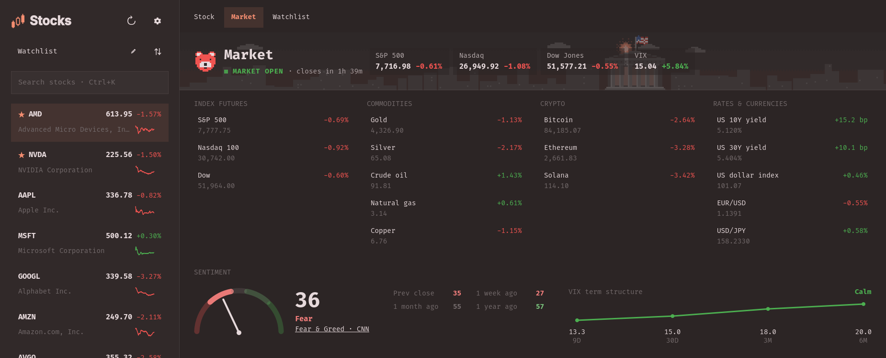
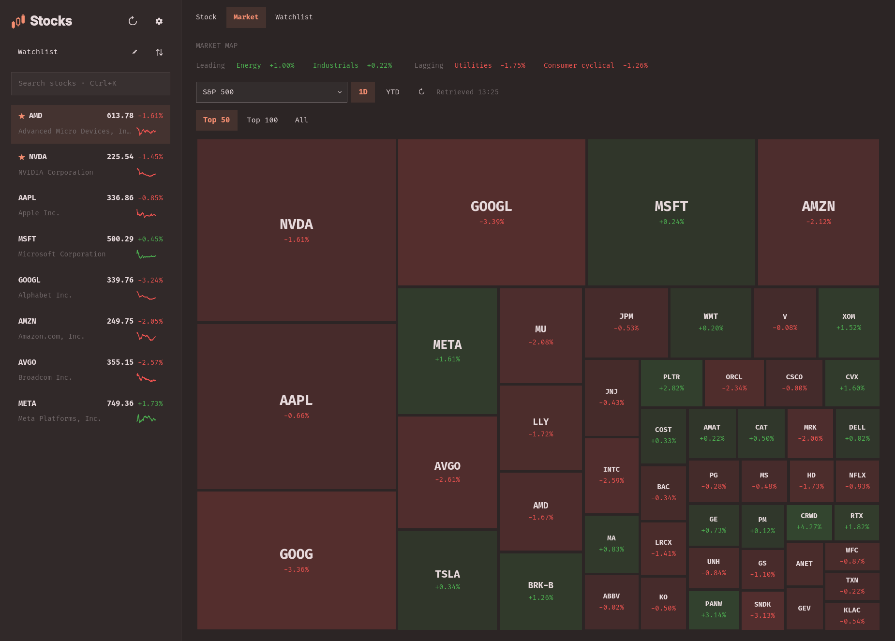
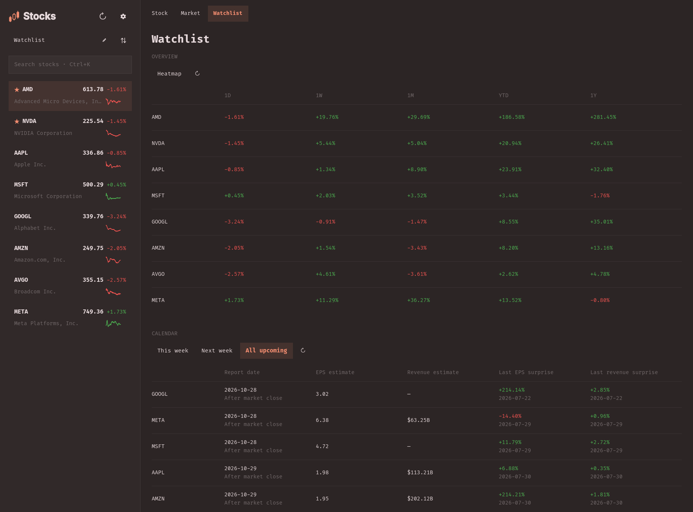
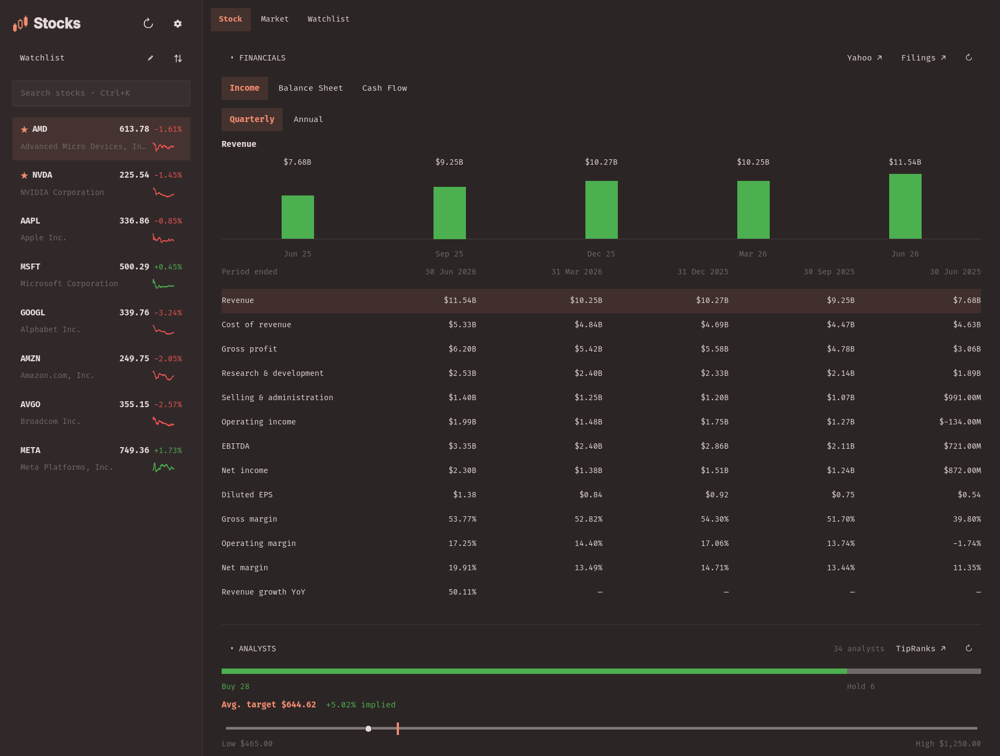
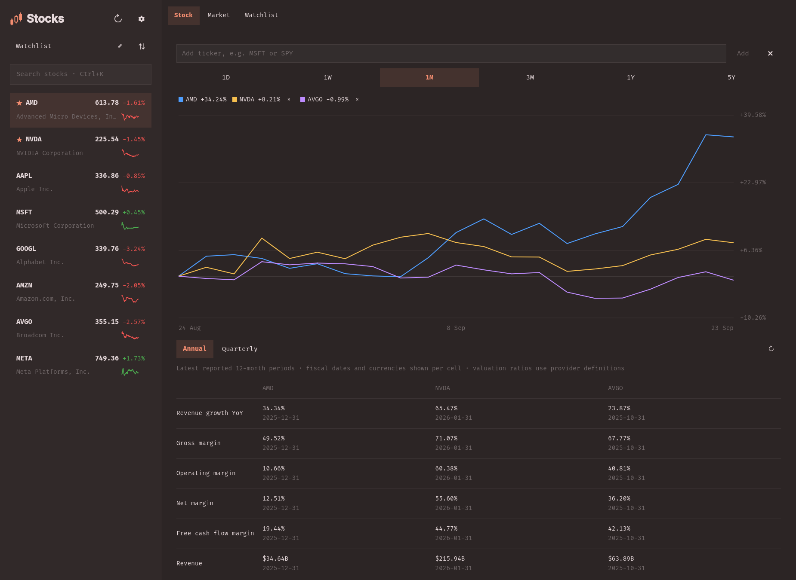

# Omastocks

A tileable stock research app for [Omarchy](https://omarchy.org), with an optional
favorites ticker in the top bar. Built with Quickshell; follows your desktop's
theme, fonts and scaling. No API keys or Python dependencies.


## Install

Requires **Omarchy's Quickshell-based shell**, Python **3.10+**, and `tzdata`.

```sh
omarchy plugin add https://github.com/dmitry-solomadin/omastocks --enable
omarchy-shell io.github.dmitry-solomadin.omastocks open
```

To add **Omastocks** to your application launcher:

```sh
~/.config/omarchy/plugins/io.github.dmitry-solomadin.omastocks/install-launcher
```

Installation is user-local. The window is titled **Stocks**; closing it leaves
the optional favorites ticker running.

## Explore

| View | What's inside |
|---|---|
| **Stock** | Six chart ranges, extended hours, volume, moving averages, earnings, financial statements, analyst targets, insider activity, news and social feeds. **Compare** combines charts and fundamentals for up to five symbols. |
| **Market** | Index benchmarks, futures, commodities, crypto, rates and currencies; Fear & Greed and VIX sentiment; sector/index heatmaps; US economic releases and market news. |
| **Watchlist** | Performance from 1D through 1Y, a heatmap, and an earnings calendar with EPS/revenue estimates and the latest surprises. |

Market maps cover the **S&P 500, Nasdaq 100, Dow Jones**, and **11 sectors**.
Choose **1D / YTD** and **Top 50 / Top 100 / All** for larger indexes. Click a
benchmark, instrument or tile to open its Stock view.

### Watchlists and controls

- Search by ticker or company name; click **+** to add a result.
- Use the list dropdown and **pen** to manage up to **12 lists, 60 stocks each**.
- **Sort Watchlist** offers Custom, Price Change, Percentage Change, Market Cap,
  Symbol and Name. Drag rows in **Custom** mode; the Overview follows the same order.
- **Star** a stock to put it in the top bar. Favorites are shared across lists;
  an overflowing ticker scrolls and pauses on hover.
- **Settings** controls the topbar widget, its fields and width, the sidebar's
  displayed metric, chart volume and event markers.
- Hover a chart for prices; drag to measure an interval. Moving averages are
  available on **1M and longer** ranges. **Extended** adds supported pre-/post-market
  sessions to 1D. Expand a research section to load its details.
- **Last report**, earnings-call links, headlines and source buttons open in your
  browser. The Last report link resolves Google's first result for the release.

| Shortcut | Action |
|---|---|
| `Ctrl+K` | Focus search |
| `↑` / `↓` | Select the previous/next stock |
| `Ctrl+R` | Refresh the current view |
| `Escape` | Clear a chart selection, exit Compare, or clear search |
| `Ctrl+W` | Close Stocks |

## Screenshots

<details>
<summary>Market overview, heatmap, watchlist, research and comparison</summary>

### Market overview


### Market map


### Watchlist


### Company research


### Compare


</details>

## Data and storage

Public feeds from **Yahoo Finance, Nasdaq, TradingView, CNN, Google News,
Stocktwits and ApeWisdom** supply the data. Prices may be delayed, earnings dates
may be estimates, and coverage varies. Missing values stay **—**; failed refreshes
retain saved data. Manual refresh respects provider rate limits.

Watchlist returns exclude dividends. Market-map areas use company market cap,
not official index weights; memberships are [bundled snapshots](data/README.md).
Financials retain reporting dates and currencies. Reddit mentions measure
attention, not sentiment. Company-only panels are hidden for non-company instruments.

Watchlists and caches live in
`${XDG_STATE_HOME:-~/.local/state}/omarchy/io.github.dmitry-solomadin.omastocks/`.
Display preferences use Omarchy's plugin settings. Queries go to the relevant
provider; there is no telemetry or account setup. See
[network and cache details](docs/DEVELOPMENT.md#data-flow) for contributors.

## Update or remove

```sh
omarchy plugin update io.github.dmitry-solomadin.omastocks
~/.config/omarchy/plugins/io.github.dmitry-solomadin.omastocks/uninstall
```

Uninstall asks for confirmation and removes the plugin, launcher and icon while
preserving your watchlists and caches.

## Development

```sh
git clone https://github.com/dmitry-solomadin/omastocks
cd omastocks
./install
```

```text
qml/        UI, shared stores and JavaScript, organized by feature
bin/        Python data helpers and provider integrations
assets/     Launcher entry and icon
data/       Saved market memberships and their provenance
tests/      Python and JavaScript regression tests
docs/       Contributor guide and screenshot gallery
```

`./install` symlinks your checkout into Omarchy. See the
[contributor guide](docs/DEVELOPMENT.md) for architecture, checks and reload commands.
The experimental **Brief me** AI feature lives on [`feature/brief-me`](https://github.com/dmitry-solomadin/omastocks/tree/feature/brief-me).

## License

[MIT](LICENSE). Market data and publisher images belong to their respective
providers. Inspired by the favorites-strip interaction in CostaFot's Markets plugin.
